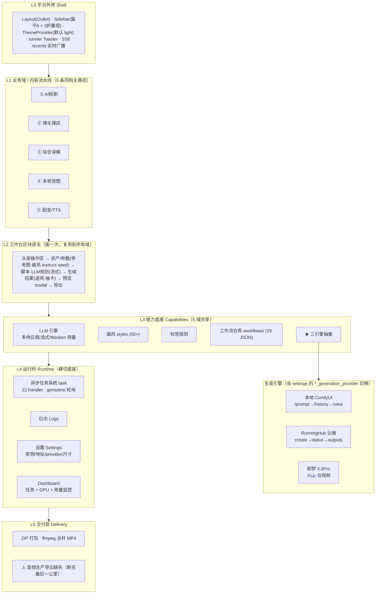

# Go-Ai-Studio 产品实现框架

> 一个「LLM 想清楚 → 引擎做出来」的批量内容生产工作台。5 类内容共用同一条流水线范式
> （建项目 → 规划 → 批量出素材 → 成片）和同一套底座；差异只在各自的"规划逻辑"和"出素材种类"。

## 分层架构

## ★ RunningHub 生成引擎覆盖矩阵

每类素材由 `settings` 的 `image_/video_/audio_generation_provider` 在 **本地 ComfyUI / RunningHub / 即梦** 间切换。
当前 RunningHub 接入实况：

| 内容域 | 图片 → RH | 视频 → RH | 音频 → RH |
|---|---|---|---|
| 综合讲解 | ✅ 已接·实测 | ✅ 已接 | — |
| 博主探店 | ✅ 已接·实测(单+批) | ✅ 已接(单+批) | — |
| 短剧 | 🚧 未接(走本地) | ✅ 单场景已接(分段/转场 🚧) | — |
| 多视觉图 | 🚧 未接 | — | — |
| 探店菜品 | 🚧 未接 | 🚧 未接 | — |
| 配音生产 | — | — | ✅ 已接 |
| Qwen TTS / LongCat 克隆 | — | — | ✅ 已接(单+批) |
| ASR 参考识别 | — | — | 🚧 未接(输出文本非文件) |

- 关键约束：RunningHub 只能跑平台上已发布的 workflow（用 `workflowId` 引用 + `nodeInfoList` 覆盖参数）。
  本地 workflow 文件名 → RunningHub `workflowId` 的映射在系统设置里维护。
- 免费档单并发：批量生成已加全局串行化（`runninghub_concurrency`，默认 1）。

## 模块完整度（产品闭环 × 可靠性）

| 模块 | 产品闭环 | 可靠性 |
|---|---|---|
| AI 短剧 | ✅ 最成熟(失败续写/集间记忆/批量/导出) | ⚠️ 视频无暂停、不能只重生指定场景 |
| 博主探店 | ✅ 八态最全(单/批/reroll/中断/重置/导出) | ✅ RH 图+视频实测通过 |
| 综合讲解 | ✅ 规划→场景→转场→导出完整 | ⚠️ 缺中断接口 |
| 多视觉图 | ⚠️ 半成品：不能单张重 roll | 🚧 RH 未接 |
| 配音/TTS/克隆 | ⚠️ 生产线导出已补；五入口实为三心智 | ✅ RH 已接(单稳/批受并发限) |

## 待办（按优先级）

1. 🔴 配音五入口收成三（按「克隆/预设/描述」三种心智重组侧栏）
2. 🟢 ~~补音频生产导出~~（已完成）
3. 🟢 ~~RunningHub 免费档并发串行化~~（已完成，`runninghub_concurrency`）
4. 🟡 provider 三套开关易错配 → 考虑「全局优先 RunningHub」总开关
5. 🟡 workflowId 映射手工易错 → 保存时校验
6. 🟡 手搓组件未沉淀（card/table/tabs/badge/status）→ 沉淀复用件
7. 🟡 `AutoSeries.tsx` 孤儿页（761 行未挂路由）→ 清理

---
*本框架图由 Jian（质检）、小龙（产品）、Nina（设计）三方整站摸底综合而成。*
